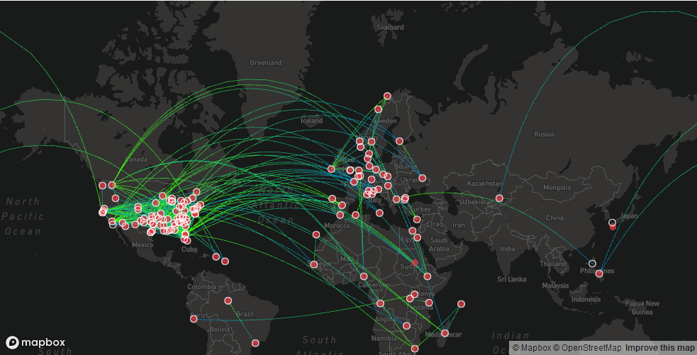

# Flight Route Visualization Using Pydeck

## Background
The goal of this project is to help me getting know and familiarize me with pydeck library for creating geospatial map visualization. In this project, we will be creating flight route visualization using dataset of route flight and airport from Kaggle.

 

## Dataset
You can get the dataset from here : 
- Airport Dataset : https://www.kaggle.com/jinbonnie/airport-information
- Flights Route Dataset : https://www.kaggle.com/open-flights/flight-route-database

 

## Package needed
You will need these python packages to recreate this project
- pandas
- pydeck
- seaborn
- matplotlib

## Visualization Result
The result of this project is creating visualization like below:

